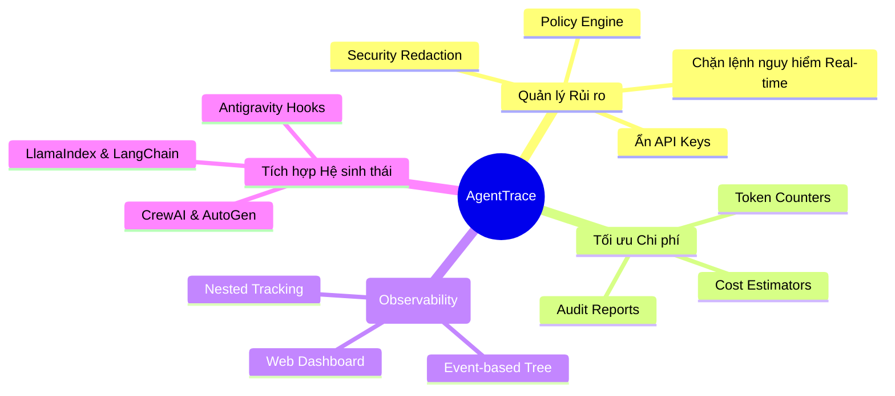

# Chương 1: Giới thiệu & Triết lý Thiết kế của AgentTrace

Chào mừng bạn bước vào thế giới giám sát AI thế hệ mới với **AgentTrace**. Tài liệu này sẽ không chỉ hướng dẫn bạn cách dùng, mà còn giúp bạn hiểu được "linh hồn" và lý do vì sao dự án này tồn tại.

---

## 1. Nỗi đau (Pain Points) của kỷ nguyên LLM Agents

Khi xây dựng các hệ thống AI Agents dựa trên LLM (Large Language Models), các kỹ sư phần mềm thường xuyên đối mặt với 3 bài toán sinh tử:

> [!WARNING]
> **1. Hộp Đen Suy Luận (The Reasoning Blackbox)**
> Khi Agent nhận một lệnh phức tạp từ người dùng (vd: "Phân tích tài chính công ty X và gửi email cho Y"), nó sẽ thực hiện chuỗi hành động ReAct (Reasoning & Acting). Nếu kết quả cuối cùng bị sai, bạn không thể biết nó sai ở bước tìm kiếm web, bước đọc file, hay bước sinh văn bản.

> [!CAUTION]
> **2. Rủi ro Bảo mật Chết người (Catastrophic Security Risks)**
> Nếu cấp cho LLM quyền sử dụng công cụ dòng lệnh (Terminal) hoặc chạy code Python, một câu lệnh "ảo giác" (hallucination) như `rm -rf /` hoặc lệnh SQL `DROP TABLE` có thể quét sạch toàn bộ hệ thống của bạn trong tích tắc.

> [!WARNING]
> **3. Chi phí Chìm Khổng Lồ (Hidden Financial Costs)**
> Việc Agent tự động lặp (loop) và thử sai có thể đốt cháy hàng triệu Token chỉ trong vài phút, biến hóa đơn OpenAI của bạn thành ác mộng.

---

## 2. Giải pháp của AgentTrace

AgentTrace không phải là một thư viện Logging thông thường (như Python `logging`). Nó là một **Hệ sinh thái Quản trị (Governance Ecosystem)**. 

### Sơ đồ Tư duy Giải quyết vấn đề (Mindmap)

### Triết lý "Local-First" và "Privacy-Centric"

Khác với LangSmith hay Phoenix, AgentTrace được thiết kế với triết lý **Local-First**. 
- Toàn bộ dữ liệu logs, tokens, nội dung cuộc hội thoại của bạn với AI được lưu giữ **ngay trên máy tính của bạn** thông qua SQLite (hoặc Server Postgres nội bộ do bạn tự host).
- Không có bất kỳ byte dữ liệu nào bị gửi lên một Cloud bên thứ ba (Third-party Cloud). Đảm bảo tuân thủ GDPR và các chính sách bảo mật khắt khe nhất của Enterprise.

> [!TIP]
> Việc sử dụng kiến trúc Local-First giúp AgentTrace có tốc độ ghi log cực nhanh (độ trễ dưới 5ms), gần như không ảnh hưởng (zero overhead) đến hiệu năng của hệ thống AI chính.

---

[Tiếp theo: Chương 2 - Kiến trúc Hệ thống Phân tán →](02-architecture.md)
