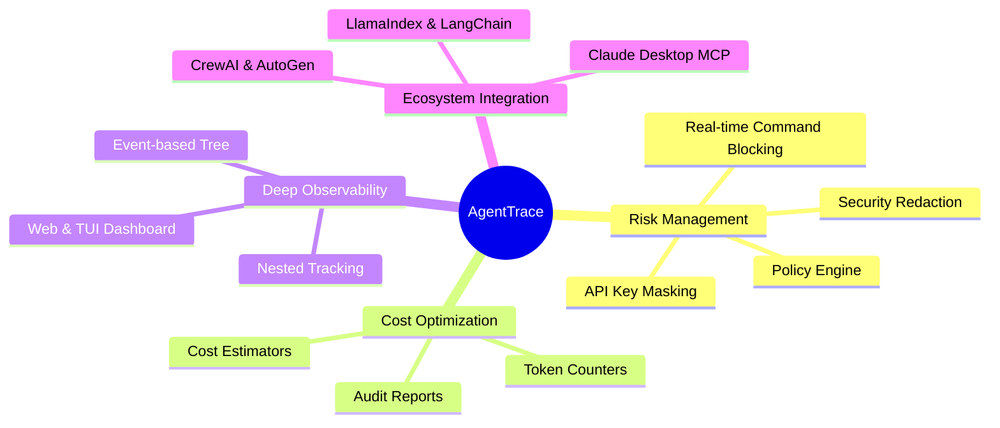

# Chapter 1: Introduction & Design Philosophy

Welcome to the vanguard of Artificial Intelligence observability: **AgentTrace**. This document will not only serve as a technical guide but will also illuminate the "soul" of the project and the foundational reasons for its existence. 

---

## 1. The Pain Points of the LLM Agent Era

When software engineers architect AI Agent systems relying on Large Language Models (LLMs), they inevitably collide with three existential challenges:

> [!WARNING]
> **1. The Reasoning Blackbox**
> When an Agent receives a complex objective from a user (e.g., "Analyze the financial data of Company X and draft an email to the CFO"), it initiates a complex ReAct (Reasoning & Acting) loop. If the final output is flawed, you are left completely blind. Was the web search query malformed? Did it misinterpret a file? Or was the final text generation hallucinated? Traditional logging cannot capture the non-linear thought processes of an LLM.

> [!CAUTION]
> **2. Catastrophic Security Vulnerabilities**
> Endowing an LLM with the capability to execute terminal commands or run Python scripts is akin to handing a loaded weapon to a toddler. A single hallucinated command such as `rm -rf /` or a rogue SQL `DROP TABLE` can permanently obliterate your production environment in milliseconds.

> [!WARNING]
> **3. Massive Hidden Financial Costs**
> Autonomous Agents have a tendency to enter infinite retry loops when they encounter errors. Without stringent oversight, an Agent can silently burn through millions of tokens in a matter of hours, transforming your monthly OpenAI API bill into an absolute nightmare.

---

## 2. The AgentTrace Solution

AgentTrace transcends the boundaries of standard logging libraries (such as Python's native `logging` module). It is an **Enterprise Governance Ecosystem** engineered specifically for the deterministic control of non-deterministic AI models.

### Problem-Solving Mindmap

### The "Local-First" & "Privacy-Centric" Philosophy

In stark contrast to SaaS-based tracing platforms like LangSmith or Phoenix, AgentTrace is strictly architected on a **Local-First** philosophy.
- The entirety of your logs, token metrics, and sensitive conversational data with the AI remains securely confined **on your local machine** via SQLite (or an internal, self-hosted PostgreSQL server).
- Absolutely zero bytes of your proprietary data are ever transmitted to a third-party cloud. This guarantees strict compliance with GDPR, HIPAA, and the most rigorous enterprise data security policies.

> [!TIP]
> **Zero Overhead Execution**
> By utilizing a local-first architecture, AgentTrace achieves sub-millisecond logging latency. This ensures that integrating AgentTrace introduces virtually **zero overhead** to the performance of your primary AI application, even under immense asynchronous loads.

---

[Next: Chapter 2 - Distributed Architecture & System Design →](02-architecture.md)
