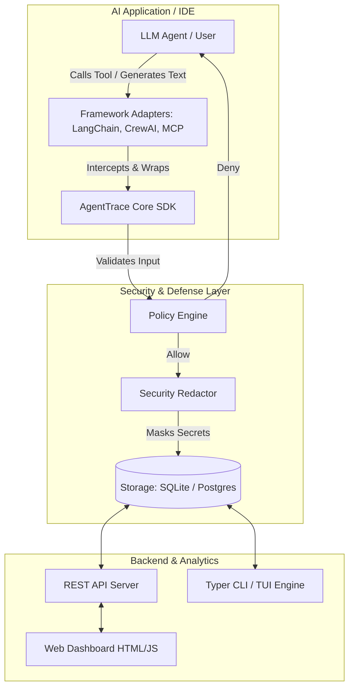

# Chapter 2: Distributed Architecture & System Design

Beneath the sleek interface and seamless integrations of AgentTrace lies a robust, **Extensible Monolith** architecture. Every core component—from the Storage backend to the Policy Engine and the Adapters—is heavily decoupled, allowing for independent scaling, hot-swapping, and enterprise-grade customization.

---

## 1. High-Level Architecture Flow

Examine the Mermaid diagram below to visualize the lifecycle of a data packet as it travels from the AI Application through the Security Layer and finally rests in the Storage Layer:

---

## 2. Anatomy of the Core Components

### A. The Data Ingestion Layer
- **`agenttrace.core` (Sync/Async SDK):** The absolute foundation of the system. Contains the `Tracer` and `AsyncTracer` classes. It is responsible for deterministic ID generation (UUID4) and maintaining the thread-safe `TraceContext` across asynchronous boundaries using Python's native `ContextVar`. This ensures that even in environments handling hundreds of concurrent LLM requests, events never bleed into the wrong trace.
- **`agenttrace.adapters`:** The "Wrappers" or "Monkey-patchers". The sole responsibility of an Adapter is to seamlessly inject tracing logic into third-party libraries (e.g., `crew.kickoff()` or `openai.chat.completions`) without requiring the end-developer to modify their business logic.

### B. The Security & Defense Layer
- **`agenttrace.policy` (Policy Engine):** Operating at the *Pre-Tool* phase. Before a tool is allowed to execute on the host machine, the Engine scans the tool's arguments against a strict rule matrix (e.g., `DangerousCommandRule`). If a violation is detected, it ruthlessly severs the execution flow, throwing an Exception or instructing the IDE Hook to block the process.
- **`agenttrace.security` (Redaction):** Operating at the *Post-Tool* phase. Regardless of whether a tool succeeded or failed, the output often contains highly sensitive information (e.g., `Authorization: Bearer sk-...`). The Redactor utilizes pre-compiled regex arrays to scrub payloads, replacing secrets with `[REDACTED]` in milliseconds.

> [!NOTE]
> **Performance Optimization**
> The Security Redactor achieves its blistering speed by leveraging pre-compiled regular expressions (`re.compile`) loaded into memory at startup. This allows it to recursively traverse and sanitize millions of characters in heavily nested JSON objects with virtually zero latency.

### C. The Storage & Analytics Layer
- **`agenttrace.storage`:** Defined via Abstract Base Classes (ABC). This allows enterprise teams to inject custom backends (like MongoDB or Redis) simply by inheriting the base class and implementing 5 core methods. Out of the box, AgentTrace ships with lightning-fast `LocalStorage` (SQLite) and highly scalable `PostgresStorage`.
- **`agenttrace.server.api`:** A high-performance REST API built on top of FastAPI. This is critical for scenarios where the IDE (like Antigravity or Claude Desktop) runs in an entirely separate OS process from the AgentTrace tracking server and must communicate over HTTP port 8000.

---

## 3. The Core Data Model

The entire ecosystem revolves around two fundamental, relational objects: the **Run** and the **Event**.

| Field Name | Data Type | Description |
| :--- | :--- | :--- |
| **Run.id** | `UUID (String)` | A globally unique identifier representing a single working session, conversation, or task. |
| **Run.metadata** | `JSONB / Dict` | A flexible schema for storing extended configuration (e.g., LLM Model Name, Temperature, Environment variables). |
| **Event.run_id** | `UUID` | The foreign key linking this event back to its parent Run. |
| **Event.parent_id** | `UUID` | Enables the creation of deeply nested Execution Trees (e.g., a "Code Generation" event nested under a "Bug Fixing" parent event). |
| **Event.metadata** | `JSONB / Dict` | The primary payload store. Holds the Input, Output, Error Tracebacks, and crucially, the **Metrics** (Prompt/Completion Tokens and USD Cost). |

---

[Next: Chapter 3 - Core SDK Programming Guide →](03-core-sdk-usage.md)
