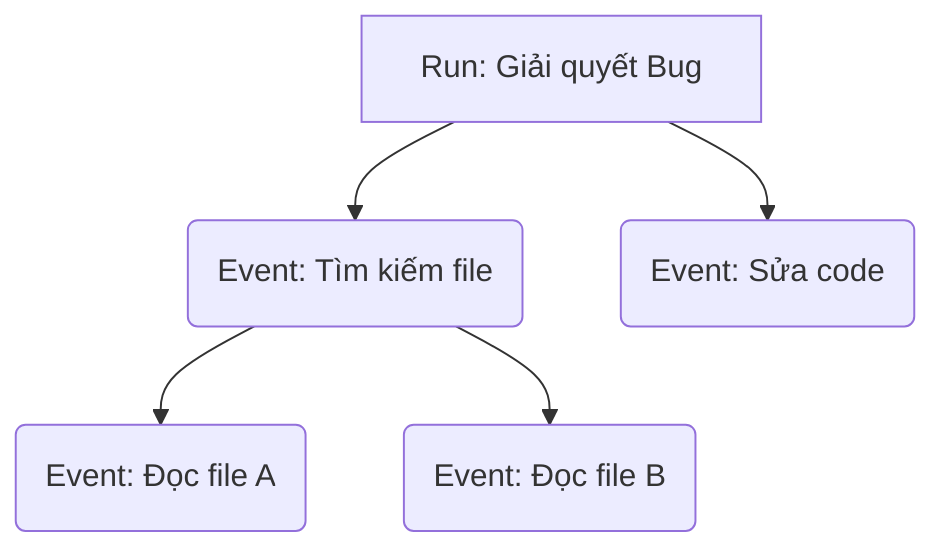

# 2. Kiến trúc Hệ thống (Architecture)

AgentTrace được thiết kế nguyên khối (monolithic) với tính chất module hóa cao, đảm bảo vừa dễ dùng vừa dễ mở rộng.

## Các Thành Phần Chính

1. **Core SDK (`agenttrace.core`)**
   - Quản lý vòng đời của một Run và các Event.
   - Cung cấp decorator `@trace_tool` để bọc các hàm Python thông thường.
2. **Storage Layer (`agenttrace.storage`)**
   - Lớp trừu tượng cho phép lưu trữ ở nhiều backend khác nhau.
   - `LocalStorage`: Backend mặc định sử dụng SQLite, tạo file `.db` cục bộ để lưu dữ liệu.
3. **Adapters (`agenttrace.adapters`)**
   - Các module hỗ trợ kết nối nhanh với các thư viện Agent của bên thứ ba (OpenAI, LangChain, LlamaIndex, MCP).
4. **API & Server (`agenttrace.server`)**
   - Server sử dụng FastAPI.
   - Cung cấp RESTful API (`POST /api/runs`, `POST /api/events`) cho các hệ thống ngoại lai (như Antigravity IDE) đẩy dữ liệu vào.
   - Cung cấp Web UI (HTML/JS/CSS) phục vụ Dashboard.
5. **CLI (`agenttrace.cli`)**
   - Giao diện dòng lệnh giúp khởi động Server, xuất dữ liệu, hoặc quản lý cơ sở dữ liệu.

## Mô Hình Dữ Liệu (Data Model)

Mô hình dữ liệu của AgentTrace bao gồm 2 thực thể chính:

- **Run**: Đại diện cho một phiên làm việc hoặc một vòng đời đầy đủ của Agent (ví dụ: Một phiên chat).
- **Event**: Đại diện cho một thao tác nhỏ bên trong Run (ví dụ: Tool bắt đầu, Tool kết thúc, Agent suy luận). Event có thể có `parent_id` để tạo thành cấu trúc cây.

---

[Tiếp theo: Hướng dẫn SDK Cốt lõi →](03-core-sdk-usage.md)
