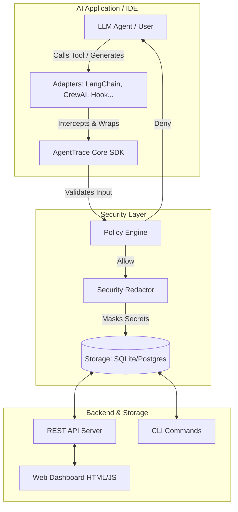

# Chương 2: Kiến trúc Hệ thống (Architecture)

Đằng sau sự linh hoạt của AgentTrace là một kiến trúc nguyên khối được thiết kế để dễ dàng mở rộng (Extensible Monolith). Bất kỳ thành phần nào (Storage, Policy, Adapter) đều có thể được thay thế hoặc nâng cấp độc lập.

---

## 1. Sơ đồ Cấu trúc Tổng thể (High-level Architecture)

Hãy xem sơ đồ Mermaid dưới đây để hiểu cách dữ liệu chảy qua hệ thống:

---

## 2. Giải phẫu các Component Lõi

### A. Tầng Thu thập (Data Ingestion Layer)
- **`agenttrace.core` (Sync/Async SDK)**: Nơi chứa class `Tracer` và `AsyncTracer`. Chịu trách nhiệm cấp phát ID (UUID4), duy trì ngữ cảnh (TraceContext) qua `ContextVar` (giúp theo dõi an toàn trong môi trường đa luồng - Multithreading/Async).
- **`agenttrace.adapters`**: Các lớp "Bọc" (Wrapper/Monkey-patch). Nhiệm vụ của Adapter là chèn mã độc (theo nghĩa tốt) vào các thư viện bên thứ 3 (như `crew.kickoff` hoặc `openai.chat.completions`) để cướp luồng thực thi và gửi dữ liệu về SDK mà không bắt Developer phải sửa source code.

### B. Tầng Bảo mật (Defense Layer)
- **`agenttrace.policy` (Policy Engine)**: Trước khi Tool chạy, Engine sẽ quyét qua tập các Rules (Ví dụ: `DangerousCommandRule`). Nếu phát hiện vi phạm, nó can thiệp trực tiếp để văng ra Exception hoặc thông báo tới IDE Hook chặn tiến trình.
- **`agenttrace.security` (Redaction)**: Sau khi Tool chạy xong (dù thành công hay thất bại), kết quả trả về thường chứa dữ liệu nhạy cảm. Redactor dùng Regex quét và thay thế `sk-1234...` thành `[REDACTED]`.

> [!NOTE]
> Quá trình Redaction được tối ưu hóa cực đỉnh bằng cách biên dịch (compile) trước tập lệnh Regex, giúp nó có thể quét hàng triệu ký tự output chỉ trong vài mili-giây.

### C. Tầng Lưu trữ & Hiển thị (Storage & Presentation Layer)
- **`agenttrace.storage`**: Định nghĩa Abstract Base Class (ABC). Bạn có thể tự viết thêm `MongoStorage` hoặc `MySQLStorage` chỉ bằng cách kế thừa và implement 5 hàm (create_run, update_run, get, list...). Hiện tại hỗ trợ sẵn `LocalStorage` (SQLite) và `PostgresStorage`.
- **`agenttrace.server.api`**: Web Server viết bằng FastAPI, cung cấp API HTTP chuẩn mực. Rất hữu ích khi IDE (như Antigravity) không chạy cùng chung tiến trình (process) với AgentTrace mà phải giao tiếp qua cổng 8000.

---

## 3. Mô Hình Dữ Liệu Lõi (Core Data Model)

Hệ thống xoay quanh 2 Object chính: **Run** và **Event**.

| Trường (Field) | Kiểu dữ liệu (Type) | Ý nghĩa (Description) |
| :--- | :--- | :--- |
| **Run.id** | `UUID (String)` | ID duy nhất cho một phiên làm việc (Conversation/Task). |
| **Run.metadata** | `JSONB / Dict` | Chứa các thông tin cấu hình mở rộng (ví dụ LLM Model name). |
| **Event.run_id** | `UUID` | Khóa ngoại chỉ định Event này thuộc về Run nào. |
| **Event.parent_id** | `UUID` | Giúp tạo ra cấu trúc cây (Tree) - Ví dụ Event "Sinh Code" là con của Event "Giải quyết Bug". |
| **Event.metadata** | `JSONB / Dict` | Nơi lưu Input, Output, Lỗi, và đặc biệt là **Metrics** (Token đếm được). |

---

[Tiếp theo: Chương 3 - Hướng dẫn Lập trình Core SDK →](03-core-sdk-usage.md)
