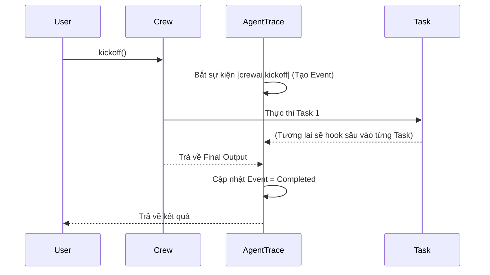

# Chương 4: Tích hợp Multi-Agent Frameworks (Adapters)

Không phải ai cũng thích tự code Agent bằng tay. Đại đa số chúng ta xài các Framework nổi tiếng. **AgentTrace Adapters** sinh ra để bạn gắn khả năng "Tracing" vào các Framework này chỉ với 2 dòng code.

---

## Bảng So Sánh Các Adapters Hỗ Trợ

| Adapter | Loại Hook | Mô tả | Hỗ trợ Metrics (Token/Tiền) |
| :--- | :--- | :--- | :---: |
| **OpenAI** | Monkey-patch | Bọc thẳng vào hàm `client.chat.completions.create`. | ✅ Có |
| **LangChain** | Callback Handler | Bắt toàn bộ luồng Chain, LLM, Tool qua hệ thống Event. | ❌ Không (Sắp ra mắt) |
| **LlamaIndex** | Global Handler | Ngồi vào lõi Dispatcher của LlamaIndex. | ❌ Không |
| **CrewAI** | Monkey-patch | Tracing từ cấp độ Crew xuống từng Task, từng Agent. | ❌ Không |
| **AutoGen** | Wrapper | Theo dõi đoạn chat qua lại giữa các Agent. | ❌ Không |

---

## 1. OpenAI Adapter (Tính tiền & Token tự động)

> [!IMPORTANT]
> Đây là Adapter "xịn" nhất hiện tại. Nó không chỉ ghi log mà còn **đọc Token Usage** từ OpenAI trả về, sau đó nhân với đơn giá của GPT-4o để lưu ra con số USD ($) hiển thị thẳng lên Dashboard Chart.js!

```python
from openai import OpenAI
from agenttrace.core import Tracer
from agenttrace.adapters.openai import OpenAIChatAdapter

tracer = Tracer()
run_id = tracer.start_run(agent="OpenAIAgent", task="Viết thơ")

client = OpenAI(api_key="sk-...")

# 1. Bọc (Wrap) OpenAI Client lại
adapter = OpenAIChatAdapter(tracer)
wrapped_client = adapter.wrap_client(client)

# 2. Xài như bình thường, mọi thứ tự động được ghi nhận và tính tiền!
response = wrapped_client.chat.completions.create(
    model="gpt-4o",
    messages=[{"role": "user", "content": "Viết thơ về code"}]
)
```

## 2. CrewAI Adapter (Quản trị Đội nhóm AI)

Khi bạn có một công ty ảo với Giám đốc (Manager Agent), Lập trình viên (Coder Agent) và QA (Tester Agent), CrewAI là lựa chọn số 1.

```python
from crewai import Agent, Task, Crew
from agenttrace.adapters.crewai import CrewAIAdapter

# Khởi tạo Crew bình thường
my_crew = Crew(
    agents=[researcher, writer],
    tasks=[task1, task2]
)

# Gắn "Máy nghe lén" AgentTrace vào Crew
adapter = CrewAIAdapter(tracer)
traced_crew = adapter.attach(my_crew)

# Kickoff - Toàn bộ quá trình làm việc nhóm sẽ lên Dashboard!
result = traced_crew.kickoff()
```

### Luồng Hoạt Động Của CrewAI Adapter



## 3. Microsoft AutoGen Adapter

AutoGen nổi tiếng với cơ chế Chat qua lại (Conversational Agents).

```python
import autogen
from agenttrace.adapters.autogen import AutoGenAdapter

user_proxy = autogen.UserProxyAgent(name="user_proxy")
assistant = autogen.AssistantAgent(name="assistant", llm_config=llm_config)

adapter = AutoGenAdapter(tracer)
traced_user = adapter.attach(user_proxy)

# Khi initiate_chat, toàn bộ lịch sử tin nhắn sẽ được record.
traced_user.initiate_chat(assistant, message="Giải phương trình bậc 2")
```

---

[Tiếp theo: Chương 5 - Tích hợp Antigravity IDE →](05-ide-integration.md)
