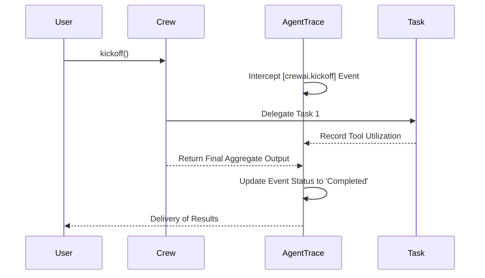

# Chapter 4: Multi-Agent Frameworks & Adapters

Reinventing the wheel by coding Agents from scratch is not always practical. The vast majority of AI engineers utilize robust frameworks like LangChain, CrewAI, or LlamaIndex. **AgentTrace Adapters** are meticulously engineered to inject advanced tracing capabilities into these third-party frameworks with merely two lines of code.

---

## Supported Adapters Matrix

| Adapter | Hook Mechanism | Description | Token & USD Cost Analytics |
| :--- | :--- | :--- | :---: |
| **OpenAI** | Monkey-patch | Directly wraps the `client.chat.completions.create` method. | ✅ Supported |
| **Anthropic** | Monkey-patch | Hooks into `client.messages.create` for Claude model tracing. | ✅ Supported |
| **LangChain** | Callback Handler | Intercepts the entire flow of Chains, LLMs, and Tools via the event bus. | ✅ Supported |
| **CrewAI** | Monkey-patch | Provides deep tracing from the holistic Crew level down to specific Agents and Tasks. | ❌ Not Supported |
| **AutoGen** | Wrapper | Monitors conversational exchanges between proxy and assistant agents. | ❌ Not Supported |

---

## 1. OpenAI Adapter (Automated Financial Accounting)

> [!IMPORTANT]
> The OpenAI Adapter is a flagship integration. Beyond merely logging requests and responses, it intercepts the `Token Usage` payload returned by OpenAI. It then calculates the exact USD cost based on dynamic pricing tables (e.g., GPT-4o) and streams this data directly into your Chart.js powered Dashboard!

```python
from openai import OpenAI
from agenttrace.core import Tracer
from agenttrace.adapters.openai import OpenAIChatAdapter

tracer = Tracer()
run_id = tracer.start_run(agent="FinancialAnalyst", task="Draft a quarterly report")

# Initialize standard OpenAI Client
client = OpenAI(api_key="sk-...")

# 1. Wrap the Client with AgentTrace
adapter = OpenAIChatAdapter(tracer)
wrapped_client = adapter.wrap_client(client)

# 2. Execute normally. Token counts and costs are silently accumulated!
response = wrapped_client.chat.completions.create(
    model="gpt-4o",
    messages=[{"role": "user", "content": "Analyze the financial status..."}]
)
```

## 2. CrewAI Adapter (Enterprise Swarm Management)

When orchestrating a virtual corporation comprising a Manager Agent, Software Engineer Agent, and QA Agent, CrewAI is the definitive framework.

```python
from crewai import Agent, Task, Crew
from agenttrace.adapters.crewai import CrewAIAdapter

# Standard Crew Initialization
my_crew = Crew(
    agents=[senior_researcher, technical_writer],
    tasks=[data_gathering_task, article_drafting_task]
)

# Attach the AgentTrace interception mechanism
adapter = CrewAIAdapter(tracer)
traced_crew = adapter.attach(my_crew)

# Kickoff - The entire collaborative workflow is visualized on the Dashboard!
result = traced_crew.kickoff()
```

### CrewAI Execution Workflow



---

## 3. Microsoft AutoGen Adapter

AutoGen excels in simulating complex, multi-agent conversational dynamics.

```python
import autogen
from agenttrace.adapters.autogen import AutoGenAdapter

user_proxy = autogen.UserProxyAgent(name="user_proxy")
assistant = autogen.AssistantAgent(name="assistant", llm_config=llm_config)

adapter = AutoGenAdapter(tracer)
traced_user = adapter.attach(user_proxy)

# Upon initiating chat, the entire dialogue history is meticulously recorded.
traced_user.initiate_chat(assistant, message="Solve the quadratic equation.")
```

---

## 4. Claude Desktop IDE (MCP Proxy)

Anthropic's Claude Desktop interacts with local tools through the highly sophisticated **Model Context Protocol (MCP)** via STDIO. AgentTrace provides a transparent MCP Proxy that acts as a Man-in-the-Middle (MITM) to intercept and govern all actions executed by Claude Desktop.

### Configuring `claude_desktop_config.json`

Typical location:
- **Mac:** `~/Library/Application Support/Claude/claude_desktop_config.json`
- **Windows:** `%APPDATA%\Claude\claude_desktop_config.json`

Assume you possess a standard MCP Server configuration:
```json
{
  "mcpServers": {
    "sqlite": {
      "command": "python",
      "args": ["-m", "mcp_sqlite", "--db-path", "production.db"]
    }
  }
}
```

To inject AgentTrace, alter the `command` to `agenttrace` and prepend `mcp-proxy --` to the arguments array:

```diff
  {
    "mcpServers": {
      "sqlite": {
-       "command": "python",
-       "args": ["-m", "mcp_sqlite", "--db-path", "production.db"]
+       "command": "agenttrace",
+       "args": ["mcp-proxy", "--", "python", "-m", "mcp_sqlite", "--db-path", "production.db"]
      }
    }
  }
```

> [!NOTE]
> Following a restart of Claude Desktop, every file read, web search, or database query initiated by Claude through this MCP Server will be rigorously intercepted, validated by the Policy Engine, and logged to your AgentTrace Dashboard!

---

[Next: Chapter 5 - IDE Integration & Lifecycle Hooks →](05-ide-integration.md)
