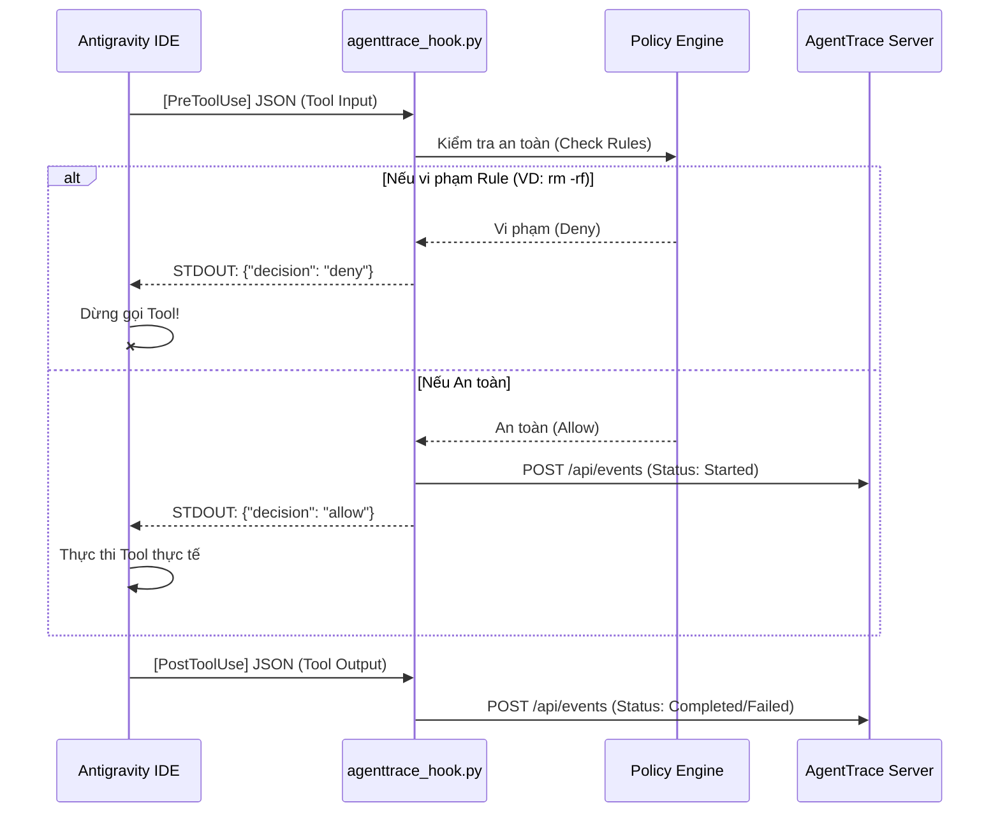

# Chương 5: Tích hợp IDE (Antigravity Hooks)

Phần này hướng dẫn bạn cách biến **AgentTrace** thành một "lớp vỏ bọc" (wrapper) giám sát cho **Antigravity IDE** - công cụ AI Coding mạnh mẽ nhất hiện nay.

Bằng cách sử dụng cơ chế Lifecycle Hooks của Antigravity, AgentTrace có thể bắt được toàn bộ lịch sử sử dụng Tool của Agent mà không cần can thiệp trực tiếp vào mã nguồn của bản thân IDE.

---

## 1. Cơ chế hoạt động (How it works?)

Khi Agent trong Antigravity quyết định gọi một tool (ví dụ: sửa file, chạy bash), luồng sự kiện xảy ra như sau:



---

## 2. Cấu hình Từng Bước (Step-by-Step)

### Bước 1: Khởi động Backend Server
Bạn phải chạy AgentTrace Server ở background để nó hứng dữ liệu từ IDE bắn qua:
```bash
agenttrace serve --port 8000
```

### Bước 2: Tạo file `hooks.json`
Vào thư mục gốc (root) của dự án mà bạn đang code bằng Antigravity, tạo folder `.agents/` và file `hooks.json`.

#### [NEW] [`.agents/hooks.json`](file:///d:/1 Số Code/AgentTrace/.agents/hooks.json)
```json
{
  "agenttrace": {
    "PreToolUse": [
      {
        "matcher": "*",
        "hooks": [
          {
            "type": "command",
            "command": "py scripts/agenttrace_hook.py pre_tool"
          }
        ]
      }
    ],
    "PostToolUse": [
      {
        "matcher": "*",
        "hooks": [
          {
            "type": "command",
            "command": "py scripts/agenttrace_hook.py post_tool"
          }
        ]
      }
    ]
  }
}
```

> [!WARNING] 
> **Thư mục làm việc (Working Directory) Cực kỳ Quan Trọng:**
> Antigravity IDE lấy thư mục chứa `hooks.json` (tức là `.agents/`) làm thư mục làm việc hiện tại (`cwd`) khi thực thi lệnh command. 
> Do đó, đường dẫn phải viết là `py scripts/agenttrace_hook.py` (tương đương với `.agents/scripts/agenttrace_hook.py`), **tuyệt đối không** viết là `py .agents/scripts/...` vì sẽ sinh lỗi *File Not Found*.

### Bước 3: Viết Script Xử Lý (The Hook Logic)

Kịch bản Python này là "Cầu nối" (Bridge). Nó đọc STDIN, gửi dữ liệu lên cổng 8000, và trả lời IDE qua STDOUT. Đồng thời, nó nhúng **Policy Engine** vào để làm chốt chặn bảo vệ.

#### [NEW] [`.agents/scripts/agenttrace_hook.py`](file:///d:/1 Số Code/AgentTrace/.agents/scripts/agenttrace_hook.py)

```diff
  import sys
  import json
  import uuid
  import urllib.request
+ # Import hệ thống bảo mật của AgentTrace
+ sys.path.insert(0, ".") # Mẹo: Thêm root để import được package agenttrace
+ from agenttrace.policy import PolicyEngine

  def main():
      event_phase = sys.argv[1] if len(sys.argv) > 1 else "pre_tool"
      input_data = sys.stdin.read() if not sys.stdin.isatty() else "{}"
      try:
          context = json.loads(input_data)
      except:
          context = {}

      # MẸO QUAN TRỌNG: Tách Từng Bước (Step Granularity)
      # Để mỗi lần gọi Tool hiển thị thành một dòng độc lập trên Dashboard,
      # Chúng ta phải nối ConversationID với StepIdx để tạo thành một Run_ID mới.
      conv_id = context.get("conversationId", str(uuid.uuid4()))
      step_idx = context.get("stepIdx", "0")
      run_id = f"{conv_id[:8]}-step-{step_idx}"
      
      tool_call = context.get("toolCall", {})
      tool_name = tool_call.get("name", "unknown_tool")
      tool_args = tool_call.get("args", {})

      if event_phase == "pre_tool":
+         # KÍCH HOẠT POLICY ENGINE: Kiểm tra lệnh nguy hiểm
+         engine = PolicyEngine()
+         is_allowed, reason = engine.check_tool(tool_name, tool_args)
+         
+         if not is_allowed:
+             # Trả về DENY cho IDE, chặn ngay lập tức!
+             print(json.dumps({"decision": "deny", "reason": reason}))
+             return

          # ... Gửi dữ liệu lên Server HTTP ...
          print(json.dumps({"decision": "allow"}))
      else:
          # ... Gửi dữ liệu cập nhật status Post-Tool ...
          print(json.dumps({}))

  if __name__ == "__main__":
      main()
```

---

[Tiếp theo: Chương 6 - CLI và Dashboard →](06-cli-and-dashboard.md)
