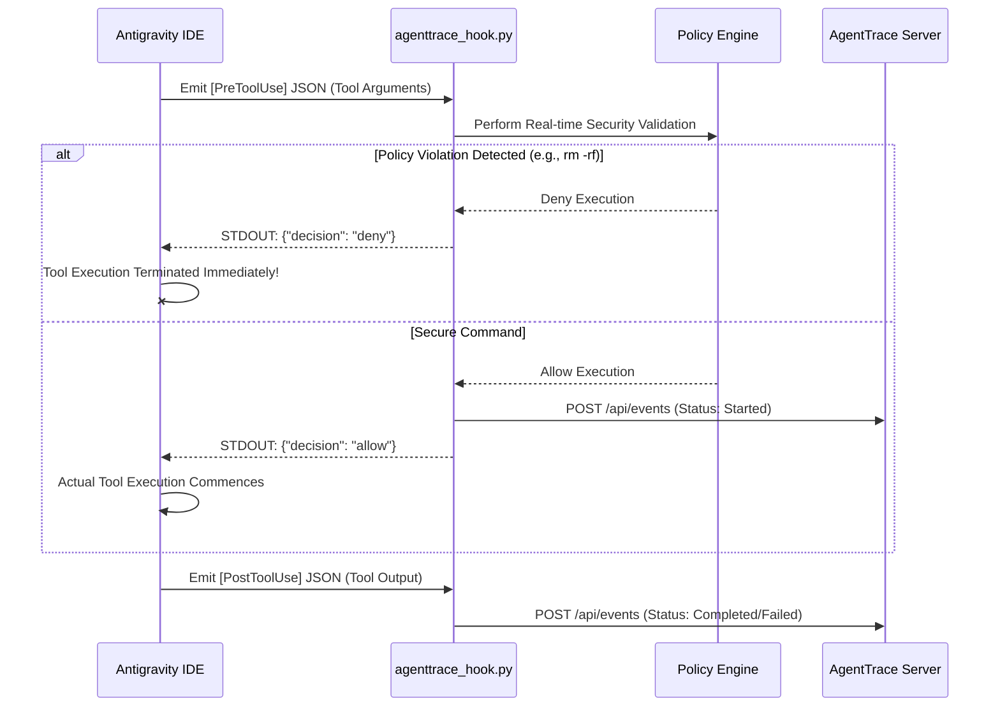

# Chapter 5: IDE Integration & Lifecycle Hooks (Antigravity)

This chapter instructs you on transforming **AgentTrace** into an impenetrable governance wrapper for **Antigravity IDE** — arguably the most powerful autonomous AI coding environment currently available.

By exploiting Antigravity's Lifecycle Hook mechanism, AgentTrace successfully intercepts the entirety of an Agent's tool invocation history without requiring any direct modifications to the IDE's core source code.

---

## 1. Operational Mechanics

When an autonomous Agent operating within Antigravity decides to execute a tool (e.g., executing a bash script, modifying a file), the ensuing event cascade is as follows:



---

## 2. Step-by-Step Configuration Guide

### Step 1: Initialize the Backend Server
You must initiate the AgentTrace API Server as a background process to ingest the HTTP data streams transmitted by the IDE:
```bash
agenttrace serve --port 8000
```

### Step 2: Establish the `hooks.json` Configuration
Navigate to the root directory of your Antigravity project. Create the `.agents/` directory (if it does not exist) and generate the `hooks.json` file.

#### [NEW] [`.agents/hooks.json`](file:///d:/1 Số Code/AgentTrace/.agents/hooks.json)
```json
{
  "agenttrace": {
    "PreToolUse": [
      {
        "matcher": "*",
        "hooks": [
          {
            "type": "command",
            "command": "py scripts/agenttrace_hook.py pre_tool"
          }
        ]
      }
    ],
    "PostToolUse": [
      {
        "matcher": "*",
        "hooks": [
          {
            "type": "command",
            "command": "py scripts/agenttrace_hook.py post_tool"
          }
        ]
      }
    ]
  }
}
```

> [!WARNING] 
> **CRITICAL Directory Warning:**
> The Antigravity IDE designates the directory containing `hooks.json` (specifically `.agents/`) as the Current Working Directory (`cwd`) when executing commands. 
> Therefore, your command path must be explicitly written as `py scripts/agenttrace_hook.py`. Attempting to write `py .agents/scripts/...` will inevitably trigger a *File Not Found* error.

### Step 3: Architecting the Hook Logic (The Bridge)

This Python script operates as the critical "Bridge". It parses `STDIN`, transmits the sanitized payloads to HTTP port 8000, and replies to the IDE via `STDOUT`. Most importantly, it embeds the **Policy Engine** as a strict, real-time security checkpoint.

#### [NEW] [`.agents/scripts/agenttrace_hook.py`](file:///d:/1 Số Code/AgentTrace/.agents/scripts/agenttrace_hook.py)

```diff
  import sys
  import json
  import uuid
  import urllib.request
+ # Import the AgentTrace Security Ecosystem
+ sys.path.insert(0, ".") # Pro-tip: Ensure the agenttrace package is resolvable
+ from agenttrace.policy import PolicyEngine

  def main():
      event_phase = sys.argv[1] if len(sys.argv) > 1 else "pre_tool"
      input_data = sys.stdin.read() if not sys.stdin.isatty() else "{}"
      try:
          context = json.loads(input_data)
      except:
          context = {}

      # ENTERPRISE PRO-TIP: Assuring Step Granularity
      # To ensure every single tool execution is rendered as an independent node
      # on the Dashboard Tree, we concatenate ConversationID with StepIdx.
      conv_id = context.get("conversationId", str(uuid.uuid4()))
      step_idx = context.get("stepIdx", "0")
      run_id = f"{conv_id[:8]}-step-{step_idx}"
      
      tool_call = context.get("toolCall", {})
      tool_name = tool_call.get("name", "unknown_tool")
      tool_args = tool_call.get("args", {})

      if event_phase == "pre_tool":
+         # POLICY ENGINE ACTIVATION: Scanning for Catastrophic Commands
+         engine = PolicyEngine()
+         is_allowed, reason = engine.check_tool(tool_name, tool_args)
+         
+         if not is_allowed:
+             # Emit DENY signal to IDE, blocking execution instantaneously!
+             print(json.dumps({"decision": "deny", "reason": reason}))
+             return

          # ... Transmit data to HTTP Server ...
          print(json.dumps({"decision": "allow"}))
      else:
          # ... Transmit Post-Tool completion data ...
          print(json.dumps({}))

  if __name__ == "__main__":
      main()
```

---

[Next: Chapter 6 - CLI Command Reference & Dashboard Analytics →](06-cli-and-dashboard.md)
